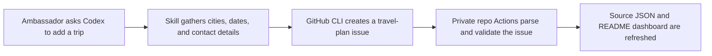

# Codex Ambassadors Travel Skill

A public Codex Skill for adding trips to the private Codex Ambassadors travel dashboard through GitHub issues.

The skill lets ambassadors ask Codex to submit travel plans without editing dashboard data by hand. If the ambassador has access to the private repo, Codex creates a `travel-plan` issue with the right tracked-city fields; the dashboard repo's GitHub Actions then clean up the issue, update source data, detect possible duplicates, and refresh the README.

## Install

Clone this repo into your Codex skills folder:

```bash
mkdir -p ~/.codex/skills
git clone https://github.com/globodex/codex-ambassadors-travel-skill ~/.codex/skills/codex-ambassadors-travel-skill
```

Then use it in Codex:

```text
Use $codex-ambassadors-travel-skill to add my Codex Ambassador trip to Tokyo from 2026-05-20 to 2026-05-24.
```

## Requirements

- GitHub CLI (`gh`) installed and authenticated.
- Access to the private dashboard repo: `globodex/codex-ambassadors-travel`.

For the org-owned private repo, granting the `codex-ambassadors` GitHub team access is the easiest way to manage ambassador access.

## How It Works



The skill creates issues with the placeholder title `WILL BE UPDATED BY AUTOMATION`. The private repo automation owns the final title, issue body cleanup, labels, duplicate warnings, and README updates.

## Manual Usage

You can also run the helper script directly:

```bash
python ~/.codex/skills/codex-ambassadors-travel-skill/scripts/add_travel_issue.py \
  --ambassador "Yashraj Nayak" \
  --destination "Tokyo, Japan|2026-05-20|2026-05-24" \
  --availability "Evenings after 6 PM" \
  --contact "Comment on the issue"
```

List current dropdown options:

```bash
python ~/.codex/skills/codex-ambassadors-travel-skill/scripts/add_travel_issue.py --list cities
python ~/.codex/skills/codex-ambassadors-travel-skill/scripts/add_travel_issue.py --list ambassadors
```

Dry-run before creating an issue:

```bash
python ~/.codex/skills/codex-ambassadors-travel-skill/scripts/add_travel_issue.py \
  --ambassador "Yashraj Nayak" \
  --destination "Tokyo, Japan|2026-05-20|2026-05-24" \
  --dry-run
```

## Repo Contents

- `SKILL.md`: Codex-facing workflow and guardrails.
- `scripts/add_travel_issue.py`: deterministic issue creator using `gh`.
- `references/travel-issue-contract.md`: issue body contract expected by the private repo automation.
